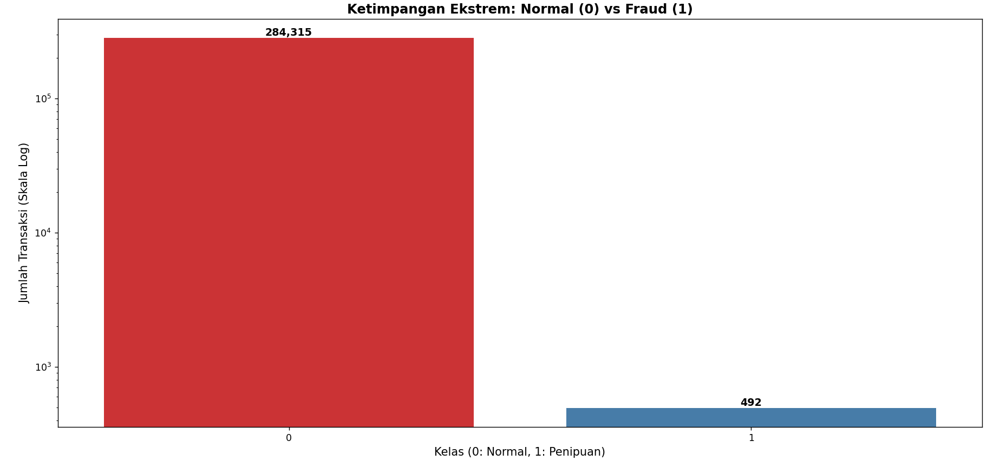
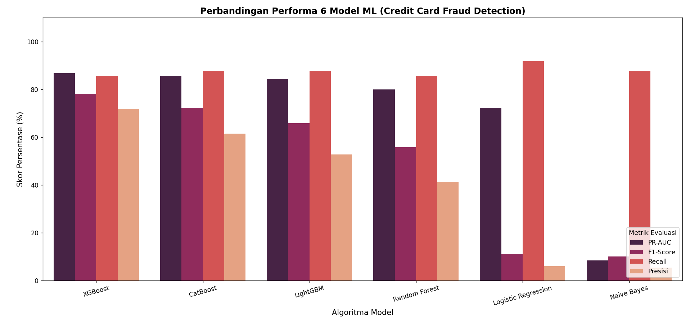
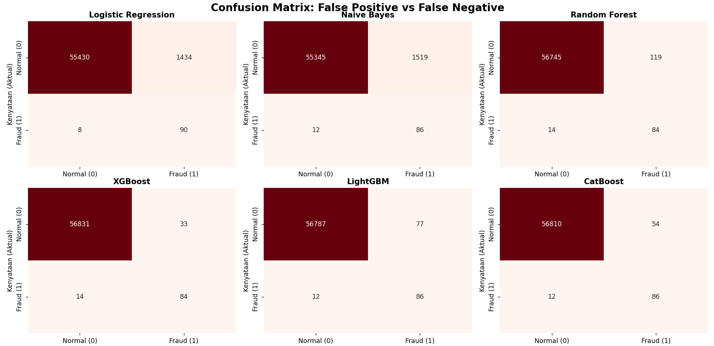

# Credit Card Fraud Detection & Prevention 💳🚨
End-to-End Machine Learning Model untuk mendeteksi transaksi penipuan kartu kredit pada data yang sangat timpang (*extreme class imbalance*), dengan fokus meminimalkan risiko salah blokir nasabah sah (*False Positive*).

## 📌 Latar Belakang & Tantangan Bisnis
Di industri perbankan modern, keamanan transaksi kartu kredit adalah prioritas utama. Tantangan terbesar dalam membangun sistem *Fraud Detection* meliputi:
1. **Ketimpangan Ekstrem (*Extreme Class Imbalance*):** Jumlah transaksi normal jauh mendominasi dibandingkan transaksi penipuan (*fraud*).
2. **Jebakan Akurasi (*The Accuracy Trap*):** Model yang asal menebak "Normal" akan tetap menghasilkan akurasi tinggi, namun gagal total mendeteksi penipu.
3. **Biaya Bisnis akibat *False Positive*:** Memblokir kartu kredit nasabah sah secara keliru akan merusak reputasi bank dan memicu komplain masif pada layanan *Customer Service*.

## 📊 Eksplorasi Data & Penanganan Ketimpangan (SMOTE)
Melalui skrip `Prediksi_Fraud.py`, data dinetralkan menggunakan teknik **SMOTE** (*Synthetic Minority Over-sampling Technique*) pada data latih, serta standarisasi fitur menggunakan **RobustScaler** untuk meredam efek *outlier*.

## 🤖 Performa Model & Benchmarking
Proyek ini menguji 6 algoritma Machine Learning sekaligus. Evaluasi difokuskan pada metrik **PR-AUC** dan **F1-Score** sebagai standar industri perbankan:
* **XGBoost & CatBoost** keluar sebagai model terbaik yang mampu menyeimbangkan metrik presisi dan *recall* secara optimal.
* Algoritma berbasis linear mengalami "paranoia" akibat manipulasi data SMOTE, sehingga menghasilkan tingkat kesalahan blokir yang sangat tinggi.

## 🔍 Evaluasi Risiko & Confusion Matrix
Melalui bedah *Confusion Matrix* dari keenam model, terlihat jelas bagaimana algoritma *ensemble* tingkat lanjut mampu menyelamatkan bank dari kerugian operasional akibat salah blokir nasabah sah (*False Positive*).

## 📁 Struktur Repositori
* `Prediksi_Fraud.py`: Skrip utama yang berisi seluruh tahapan *data preprocessing*, penerapan SMOTE, pelatihan 6 model, hingga visualisasi evaluasi.
* `Grafik_Ketimpangan_Ekstrem_Antara_Normal_vs_Fraud.png`: Visualisasi distribusi kelas awal.
* `Grafik_Perbandingan_Performa_6_Model_Machine_Learning.png`: Grafik batang komparasi metrik model.
* `Confusion_Matrix_6_Model_Machine_Learning.png`: Matriks evaluasi kesalahan tebakan dari keenam algoritma.

## 💡 Kesimpulan Bisnis
Penerapan algoritma *tree-based* (khususnya **XGBoost**) terbukti menjadi solusi paling efektif untuk institusi keuangan dalam mendeteksi sindikat penipuan secara akurat tanpa mengorbankan kenyamanan nasabah (*customer experience*).
